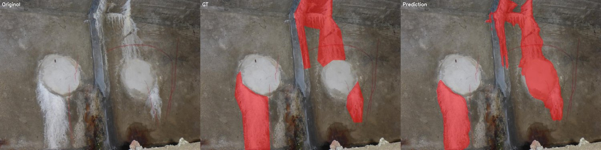
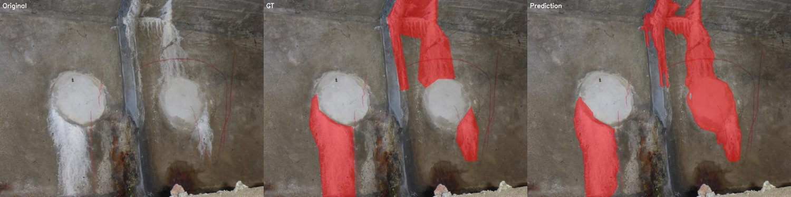

# Experiments: Efflorescence Segmentation

dacl10k_v2_devphase 데이터셋의 **백태(Efflorescence)** 단일 클래스 segmentation 실험.

## 1. 개요

| 항목 | 내용 |
|---|---|
| **Task** | Binary semantic segmentation (background vs Efflorescence) |
| **Architectures** | UPerNet + ConvNeXt (B / L), Mask2Former + Swin (B / L) |
| **Framework** | mmsegmentation 1.2.2 + mmpretrain 1.2.0 + mmdet 3.3.0 |
| **GPU** | NVIDIA RTX A5000 (24GB) |

---

## 2. 데이터셋

### dacl10k_v2_devphase / efflorescence

dacl10k v2 dev phase의 efflorescence 단일 카테고리 데이터.

| Split | 이미지 수 | 출처 |
|---|---|---|
| **train** | **1,371** | dacl train의 90% |
| **val** | **152** | dacl train의 10% |
| **test** | **206** | dacl validation |

### 전처리

- 원본 마스크: 0/255 (binary)
- 변환: 0 (background) / 1 (defect)
- 변환 스크립트: [tools/convert_dacl_efflorescence_mask.py](tools/convert_dacl_efflorescence_mask.py)

### 이미지 특성

- 가변 해상도 (600×800 ~ 1600×1200 등 76 종류)
- Efflorescence 픽셀 비율: 평균 ~3-7% (클래스 불균형 존재)

---

## 3. 학습 설정

### 공통 설정

| 항목 | 값 |
|---|---|
| Decoder | UPerNet (with auxiliary head FCNHead) |
| Pretrain | ImageNet-22K (ConvNeXt 자체) |
| Optimizer | AdamW (lr=1e-4, betas=(0.9, 0.999), weight_decay=0.05) |
| Mixed Precision | AmpOptimWrapper |
| LR Scheduler | LinearLR warmup (1,500 iter) → PolyLR (power=1.0) |
| Loss | CrossEntropyLoss (binary) |
| crop_size | 512 × 512 |
| Augmentation | RandomResize(0.5~2.0) + RandomCrop + RandomFlip + PhotoMetricDistortion |
| batch_size | 2 |
| Total Iterations | 40,000 |
| Val Interval | 4,000 iter |
| Test Inference Mode | Slide window (stride 341) |

### 모델별 차이

| 항목 | ConvNeXt-B | ConvNeXt-L |
|---|---|---|
| Params | 89M | 198M |
| embed_dims | [128, 256, 512, 1024] | [192, 384, 768, 1536] |
| decode_head channels | 512 | 768 |
| **VRAM (peak)** | ~5.0 GB | ~7.4 GB |
| **iter당 시간** | ~0.29s | ~0.39s |
| **총 학습 시간** | 약 3시간 | 약 3.5시간 |

---

## 4. 학습 결과 (Validation)

### Validation mIoU 추이

| iter | ConvNeXt-B | ConvNeXt-L |
|---|---|---|
| 4K | 60.79 | 65.18 |
| 8K | 66.76 | 66.08 |
| 12K | 67.96 | 67.13 |
| 16K | 69.41 | 68.82 |
| **20K** | 68.26 | **70.27** ⭐ |
| 24K | 67.96 | 68.31 |
| 28K | 68.36 | 68.49 |
| 32K | 70.07 | 69.30 |
| 36K | 70.06 | 68.97 |
| **40K** | **70.15** ⭐ | 70.30 |

### Best Checkpoint 선택

| Model | Best Iter | Best Val mIoU |
|---|---|---|
| **ConvNeXt-B** | iter_40000 | **70.15** |
| **ConvNeXt-L** | iter_20000 | **70.27** |

> Note: ConvNeXt-L은 20K iter에 빠르게 수렴, ConvNeXt-B는 학습 끝까지 꾸준한 향상.

---

## 5. 테스트 결과 (Test 206장)

### ConvNeXt-B (iter_40000)

| Class | IoU | F1 | Precision | Recall | FPR |
|---|---|---|---|---|---|
| background | 95.19 | 97.54 | 96.49 | 98.61 | - |
| **Efflorescence** | **55.80** | **71.63** | **81.91** | **63.64** | **1.39** |

- **mIoU**: **75.50**
- **mF1**: **84.58**

### ConvNeXt-L (iter_20000)

| Class | IoU | F1 | Precision | Recall | FPR |
|---|---|---|---|---|---|
| background | 94.73 | 97.29 | 96.05 | 98.58 | - |
| **Efflorescence** | **51.51** | **67.99** | **80.35** | **58.93** | **1.42** |

- **mIoU**: **73.12**
- **mF1**: **82.64**

---

## 6. 모델 비교

| 지표 | ConvNeXt-B | ConvNeXt-L | 차이 |
|---|---|---|---|
| Val mIoU (Best) | 70.15 | 70.27 | +0.12 (L) |
| **Test mIoU** | **75.50** | 73.12 | **+2.38 (B)** |
| **Test Efflorescence IoU** | **55.80** | 51.51 | **+4.29 (B)** |
| Test Recall | 63.64 | 58.93 | +4.71 (B) |
| Params | 89M | 198M | L is 2.2× larger |
| 학습 시간 | ~3시간 | ~3.5시간 | L is slower |

### 핵심 관찰

**ConvNeXt-B가 ConvNeXt-L보다 test 성능이 더 좋아요!**

- **Val에서는 두 모델이 거의 동등** (B: 70.15 / L: 70.27)
- **Test에서는 B가 우세** (B: 75.50 / L: 73.12)

추정 원인:
1. **데이터 부족**: 1,371장 train으로는 198M 파라미터 모델(L)이 일반화하기에 부족
2. **과적합 가능성**: ConvNeXt-L이 val에는 잘 맞지만 test 분포에 덜 일반화
3. **Best iter 차이**: L은 20K에서 best (early stop 효과), B는 40K까지 꾸준히 학습

### Val vs Test 차이

| Model | Val mIoU | Test mIoU | 차이 |
|---|---|---|---|
| ConvNeXt-B | 70.15 | 75.50 | **+5.35** |
| ConvNeXt-L | 70.27 | 73.12 | +2.85 |

→ Test 데이터(dacl validation)가 val(train의 10% split)보다 더 쉬운 케이스일 가능성. 또는 분포 차이.

---

## 7. 정성적 결과

각 이미지는 `[원본] [GT] [예측]` 가로 배치 시각화.

### ConvNeXt-B 샘플

**Sample 0012**


**Sample 0152**


**Sample 0268**


**Sample 0453**


**Sample 0810**


---

### ConvNeXt-L 샘플

**Sample 0012**


**Sample 0152**


**Sample 0268**


**Sample 0453**


**Sample 0810**


전체 206장 시각화 결과는 인퍼런스 스크립트로 재생성 가능 (아래 참고).

---

## 8. 재현 가이드

### 1) 마스크 변환

```bash
python tools/convert_dacl_efflorescence_mask.py \
    --data-root /path/to/efflorescence \
    --out-root /path/to/efflorescence_binary
```

### 2) ConvNeXt pretrained 다운로드

```bash
mkdir -p checkpoints
wget -P checkpoints/ \
    "https://download.openmmlab.com/mmclassification/v0/convnext/downstream/convnext-base_3rdparty_in21k_20220301-262fd037.pth"
wget -P checkpoints/ \
    "https://download.openmmlab.com/mmclassification/v0/convnext/downstream/convnext-large_3rdparty_in21k_20220301-e6e0ea0a.pth"
```

### 3) 학습

```bash
# ConvNeXt-B
python tools/train.py \
    configs/convnext/convnext-base_upernet_40k_dacl-efflorescence-512x512.py \
    --work-dir work_dirs/upernet_convnext-base_dacl_efflorescence

# ConvNeXt-L
python tools/train.py \
    configs/convnext/convnext-large_upernet_40k_dacl-efflorescence-512x512.py \
    --work-dir work_dirs/upernet_convnext-large_dacl_efflorescence
```

### 4) Test 평가 + 시각화

```bash
# ConvNeXt-B
python tools/inference_dacl_efflorescence.py \
    --config configs/convnext/convnext-base_upernet_40k_dacl-efflorescence-512x512.py \
    --checkpoint work_dirs/upernet_convnext-base_dacl_efflorescence/iter_40000.pth \
    --input /path/to/efflorescence_binary/test/images \
    --gt-dir /path/to/efflorescence_binary/test/masks \
    --output results_convnext_b_test/ \
    --compute-metrics

# ConvNeXt-L
python tools/inference_dacl_efflorescence.py \
    --config configs/convnext/convnext-large_upernet_40k_dacl-efflorescence-512x512.py \
    --checkpoint work_dirs/upernet_convnext-large_dacl_efflorescence/iter_20000.pth \
    --input /path/to/efflorescence_binary/test/images \
    --gt-dir /path/to/efflorescence_binary/test/masks \
    --output results_convnext_l_test/ \
    --compute-metrics
```

---

## 9. 결론

| 항목 | 추천 |
|---|---|
| **최종 모델** | **ConvNeXt-B (iter_40000)** |
| **이유** | 더 작은 모델로 test에서 더 좋은 성능, 학습 시간도 짧음 |
| **Test 성능** | mIoU 75.50, Defect IoU 55.80, F1 71.63 |

### 향후 개선 방향

| 방향 | 기대 효과 |
|---|---|
| **Class weight 적용** | Recall 향상 (현재 63.64%) |
| **Dice Loss 추가** | IoU 직접 최적화 |
| **더 강한 augmentation** | 작은 데이터셋 일반화 향상 |
| **다른 backbone 비교** | Swin-T/B, MiT-B5 등 |
| **Multi-scale inference** | Test 성능 추가 향상 가능 |

---

## 10. Mask2Former 추가 실험 (계획)

ConvNeXt 외에 **Mask2Former + Swin Transformer (B/L)** 추가 실험을 위한 config 작성.

### 설정 비교

| 항목 | UPerNet + ConvNeXt | Mask2Former + Swin |
|---|---|---|
| Decoder | UPerNet (FPN-like) | Mask2Former (Transformer decoder, 9 layers) |
| Loss | CrossEntropyLoss | CE + Dice + Mask (cls/mask/dice on 9 decoder outputs) |
| Inference | Standard | Slide window |

### 실측 자원 사용량

| 모델 | batch_size | VRAM (peak) | iter당 시간 | 40K iter 예상 |
|---|---|---|---|---|
| Mask2Former + Swin-B | 2 | ~23.5 GB | 2.21 s | ~25시간 |
| Mask2Former + Swin-L (with_cp) | 1 | ~21.3 GB | 3.05 s | ~34시간 |

> Swin-L은 메모리 제약으로 `with_cp=True` (gradient checkpointing) 적용.
> Mask2Former는 9개 decoder layer × 3개 loss로 매우 무거움 (ConvNeXt 대비 ~7배 느림).

### 추가 의존성

```bash
# mmdet 설치 필요
pip install mmdet
# 그 후 __init__.py 수정 (mmcv 2.2.0 호환 허용)

# mmcv는 우리 torch 환경(2.9.1+cu128)에 맞춰 source build 필요
git clone -b v2.2.0 https://github.com/open-mmlab/mmcv.git
cd mmcv
MMCV_WITH_OPS=1 FORCE_CUDA=1 TORCH_CUDA_ARCH_LIST='8.6' pip install -e .
```

### 자동 트리거 학습 스크립트

GPU 여유 생기면 Swin-B → Swin-L 순차 학습:
```bash
nohup bash tools/auto_train_mask2former.sh > logs_auto_train.log 2>&1 &
```

---

## 부록

### Config 파일 위치

- ConvNeXt-B: [configs/convnext/convnext-base_upernet_40k_dacl-efflorescence-512x512.py](configs/convnext/convnext-base_upernet_40k_dacl-efflorescence-512x512.py)
- ConvNeXt-L: [configs/convnext/convnext-large_upernet_40k_dacl-efflorescence-512x512.py](configs/convnext/convnext-large_upernet_40k_dacl-efflorescence-512x512.py)
- Mask2Former + Swin-B: [configs/mask2former/mask2former_swin-b_40k_dacl-efflorescence-512x512.py](configs/mask2former/mask2former_swin-b_40k_dacl-efflorescence-512x512.py)
- Mask2Former + Swin-L: [configs/mask2former/mask2former_swin-l_40k_dacl-efflorescence-512x512.py](configs/mask2former/mask2former_swin-l_40k_dacl-efflorescence-512x512.py)

### Dataset Config

- [configs/_base_/datasets/dacl_efflorescence.py](configs/_base_/datasets/dacl_efflorescence.py)
- [mmseg_custom/datasets/dacl_efflorescence.py](mmseg_custom/datasets/dacl_efflorescence.py)

### Raw Metrics

- [docs/metrics/convnext_b_test.txt](docs/metrics/convnext_b_test.txt)
- [docs/metrics/convnext_l_test.txt](docs/metrics/convnext_l_test.txt)

### Tools

- [tools/auto_train_mask2former.sh](tools/auto_train_mask2former.sh) — GPU 여유 자동 감지 + 순차 학습
